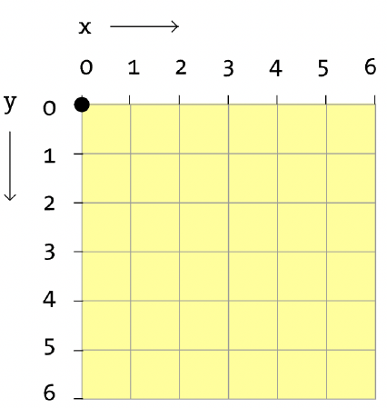

:date: 2026-06-23
:modified: 2026-06-23
:author: Esther Gordo
:license: Creative Commons Attribution-ShareAlike 4.0 International
:license_url: https://creativecommons.org/licenses/by-sa/4.0/

Práctica 01 — Paso 2: Las primeras formas
==========================================

Concepto: sistema de coordenadas
----------------------------------

En p5.js el punto (0, 0) está en la esquina superior izquierda del lienzo.
El eje X crece hacia la derecha y el eje Y crece hacia abajo (al contrario
que en matemáticas).

Las funciones principales para dibujar formas son:

- ``ellipse(x, y, ancho, alto)`` — dibuja una elipse centrada en (x, y)
- ``rect(x, y, ancho, alto)`` — dibuja un rectángulo desde la esquina
  superior izquierda (x, y)
- ``circle(x, y, diametro)`` — dibuja un círculo centrado en (x, y)

Las funciones principales para aplicar color a las formas son:

- ``fill(r, g, b)`` — establece el color de relleno en RGB antes de dibujar
- ``noFill()`` - elimina el relleno de las formas
- ``stroke(r, g, b)`` — establece el color del borde
- ``noStroke()`` — elimina el borde de las formas

Prueba: añade una forma estática
----------------------------------

Añade esto dentro de ``draw()``, después de ``background()``:

.. code-block:: javascript

   function setup() {
     createCanvas(400, 600); // ancho x alto
   }

   function draw() {
     background(220);

     fill(255, 100, 50); // naranja en RGB
     noStroke();         // sin borde
     ellipse(300, 200, 100, 100); // elipse con dos radios iguales = círculo
   }

Cambia los tres números de ``fill()`` para explorar distintos colores. Cada
número va de 0 a 255 y representa Rojo, Verde y Azul respectivamente.

.. admonition:: Truco para encontrar colores RGB

   Busca «selector de color RGB» en Google. Verás una rueda de colores con
   los valores R, G, B correspondientes que puedes copiar directamente a tu
   código.

   El editor p5.js también interpreta colores por su nombre en inglés.
   Por ejemplo::

      background("CadetBlue")

   Puedes ver la lista de nombres en:
   `https://htmlcolorcodes.com/es/nombres-de-los-colores/
   <https://htmlcolorcodes.com/es/nombres-de-los-colores/>`_
